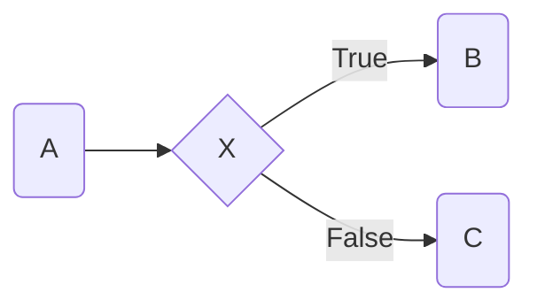

# Marksocket


## What

A python script to parse and serve markdown documents to a browser with live reload.

- Only one required external Python dependency: The markdown parser. The rest are optional Python-Markdown extensions.<br>
- Only ~200 lines of python powered by the standard library.
- Uses sockets under the hood to deliver the documents, no full fledged HTTP server needed.
- It even serves the images!
- Doesn't work on Windows however. Not my problem.

## Why

Because most of the pre-existing solutions were either gargantuan in size, shipping with over 400 npm packages as dependencies, or weren't modular enough.

## Installation

To install without any Python-Markdown extensions:

```bash
pip install marksocket
```

With Markdown-Extensions:

```bash
pip install marksocket[mermaid,highlights]
```

You can choose any or none of the extensions, mix them as you wish.

## Usage

```
marksocket [-h] [-c CONFIG_FILE] [-p PORT] -x [EXTENSION]... [-s STYLESHEET]... [-j JAVASCRIPT]... markdown_file
```

### Example

```bash
marksocket -p 8001 -s style.css readme.md
```

### Options

- -h: Help.
- -c: Configuration file.
- -p: The port to serve at. Command line argument takes precedence over the port specified in the configuration file. Defaults to 44444 if not specified on the command line or in the configuration file.
- -x: A [Python-Markdown extension](https://python-markdown.github.io/extensions/) to be loaded by the markdown parser. Multiple extensions can be specified like so:

```
marksocket -x fenced_code -x markdown_mermaid readme.md
```

- -s: A stylesheet containing css to be inserted in-line into the HTML parsed from the markdown. Multiple stylesheets are inserted in the order they are given on the command line and can be specified like so:

```
marksocket -s style1.css -s style2.css readme.md
```

- -j: A file containing JavaScript to be inserted in-line into the head tags of the HTML document. Multiple files are inserted in the order they are given on the command line and can be specified like so:

```
marksocket -j script1.js -j script2.js readme.md
```

## Configuration file

Allows specifying the port, extension, stylesheet and javascript options. If the path to a configuration file is not given as a command line argument with the `-c` option, `~/.config/marksocket/config.toml` is looked for one. However both are optional and no configuration file is required to use the program. The command line option takes precedence over the default location, so the default configuration file in `~/.config/marksocket/config.toml` will not be loaded if the configuration file option `-c` is specified.

The configuration file is written in TOML. All values in it are optional. You can specify any or none of them. It has the following schema:

```
port = int
extension = [ str ]
javascript = [ str ]
stylesheet = [ str ]
```

Example:

```toml
port = 8000
extension = [ 'markdown_mermaid', 'fenced_code' ]
javascript = [ 'mermaid.min.js', 'reload-mermaid.js' ]
stylesheet = [ 'style.css' ]
```

### Mixing configuration file and command line options

Command line options for loading extensions (`-x`), javascript files (`-j`) and stylesheet files (`-s`) can all be used simultaneously with the `extension`, `javascript` and `stylesheet` options in the configuration file. The order the files are loaded in is as follows:

1. JavaScript files specified in the configuration file, in the order they are specified.
2. JavaScript files specified on the command line, in the order they are specified.
3. Stylesheet files specified in the configuration file, in the order they are specified.
4. Stylesheet files specified on the command line, in the order they are specified.

## Extensions

### Mermaid


*Example of a Mermaid graph*

If the optional dependency `mermaid` is specified during installation:

```bash
pip install marksocket[mermaid]
```

The Markdown-Python extension [markdown-mermaid](https://github.com/rauaap/markdown-mermaid) is installed. Note that the extension itself will not render the Mermaid graphs. Include the Mermaid JavaScript library and an additional script that runs Mermaid when the document is reloaded.

> [!NOTE]
> If you're writing a markdown document for Github, it supports the Mermaid syntax out of the box, so once you're done editing your document with Marksocket, it's good to go and no additional work is required. Just push your document and the graphs will be rendered on Github too!

#### Configuration

Assume we have downloaded `mermaid.min.js` from a [CDN](https://cdn.jsdelivr.net/npm/mermaid/dist/) and also created a file `reload-mermaid.js` with the following contents:

```javascript
let scrollPos;

window.addEventListener('scroll', (e) => {
    // Only save on user initiated scrolls
    if (!e.isTrusted) {
        return;
    }

    scrollPos = window.scrollY;
});

mermaid.initialize({theme: 'dark', startOnLoad: true});
window.addEventListener('load', async () => {
    const observer = new MutationObserver(async () => {
        await mermaid.run();
        window.scrollTo(0, scrollPos);
    });

    observer.observe(document.body, {childList: true});
});
```
> *A list of available Mermaid themes can be found [here](https://mermaid.js.org/config/theming.html#available-themes).*

Now marksocket could be called with said files to enable Mermaid graph rendering:

```bash
marksocket -x markdown_mermaid -j mermaid.min.js -j reload-mermaid.js readme.md`
```

Or better yet, include it in your configuration file:

```TOML
extension = [ 'markdown_mermaid' ]
javascript = [ 'mermaid.min.js', 'reload-mermaid.js' ]
```

### Code Highlights

If the optional dependency `highlights` is specified during installation:

```bash
pip install marksocket[highlights]
```

An additional dependency [Pygments](https://pygments.org/) is installed. The Markdown-Python extension `codehilite` uses it for code highlighting (this extensions is included with Python-Markdown).

#### Configuration

Use Pygments to generate a stylesheet:

```bash
pygmentize -S github-dark -f html -a .codehilite > highlights.css
```

> *More options can be found in the [Pygments documentation](https://pygments.org/docs/) and instructions on how to get a list of available styles can be found [here](https://pygments.org/docs/styles/).*

And then include the codehilite extension with the `-x` flag and the stylesheet that was generated with the `-s` flag:

```bash
marksocket -x codehilite -x fenced_code -s highlights.css readme.md
```

Or include them in your configuration:

```TOML
extension = [ 'codehilite', 'fenced_code' ]
stylesheet = [ 'highlights.css' ]
```

> [!NOTE]
> You most likely want the [Fenced Code Blocks extension](https://python-markdown.github.io/extensions/fenced_code_blocks/) too when including code in your documents, which is why it was included in the examples. This extension ships with Python-Markdown so no additional configuration or installations are required.
